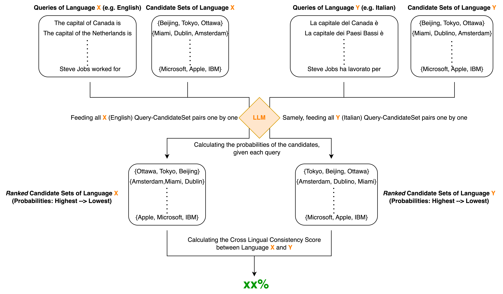

# Cross-Lingual Consistency (CLC) of Factual Knowledge in Multilingual Language Models

Easy-to-use framework for evaluating cross-lingual consistency of factual knowledge (Supported LLaMA, BLOOM, mT5, RoBERTa, etc.). 

Our [paper](https://aclanthology.org/2023.emnlp-main.658/) was selected for the Outstanding Paper Award in the Multilinguality and Linguistic Diversity track of [EMNLP 2023](https://2023.emnlp.org/) and the Best Data Award of [GenBench Workshop](https://genbench.org/workshop/)! 🎉

Authors: [Jirui Qi](https://scholar.google.nl/citations?hl=en&user=bN9bPVUAAAAJ) • [Raquel Fernández](https://staff.fnwi.uva.nl/r.fernandezrovira/) • [Arianna Bisazza](https://www.cs.rug.nl/~bisazza/) 




> **Abstract:** Multilingual large-scale Pretrained Language Models (PLMs) have been shown to store considerable amounts of factual knowledge, but large variations are observed across languages. With the ultimate goal of ensuring that users with different language backgrounds obtain consistent feedback from the same model, we study the cross-lingual consistency (CLC) of factual knowledge in various multilingual PLMs. To this end, we propose a Ranking-based Consistency (RankC) metric to evaluate knowledge consistency across languages independently from accuracy. Using this metric, we conduct an in-depth analysis of the determining factors for CLC, both at model level and at language-pair level. Among other results, we find that increasing model size leads to higher factual probing accuracy in most languages, but does not improve cross-lingual consistency. Finally, we conduct a case study on CLC when new factual associations are inserted in the PLMs via model editing. Results on a small sample of facts inserted in English reveal a clear pattern whereby the new piece of knowledge transfers only to languages with which English has a high RankC score.

If you find the paper helpful and use the content, we kindly suggest you cite through:
```bibtex
@inproceedings{qi-etal-2023-cross,
    title = "Cross-Lingual Consistency of Factual Knowledge in Multilingual Language Models",
    author = "Qi, Jirui  and
      Fern{\'a}ndez, Raquel  and
      Bisazza, Arianna",
    editor = "Bouamor, Houda  and
      Pino, Juan  and
      Bali, Kalika",
    booktitle = "Proceedings of the 2023 Conference on Empirical Methods in Natural Language Processing",
    month = dec,
    year = "2023",
    address = "Singapore",
    publisher = "Association for Computational Linguistics",
    url = "https://aclanthology.org/2023.emnlp-main.658",
    doi = "10.18653/v1/2023.emnlp-main.658",
    pages = "10650--10666",
    abstract = "Multilingual large-scale Pretrained Language Models (PLMs) have been shown to store considerable amounts of factual knowledge, but large variations are observed across languages. With the ultimate goal of ensuring that users with different language backgrounds obtain consistent feedback from the same model, we study the cross-lingual consistency (CLC) of factual knowledge in various multilingual PLMs. To this end, we propose a Ranking-based Consistency (RankC) metric to evaluate knowledge consistency across languages independently from accuracy. Using this metric, we conduct an in-depth analysis of the determining factors for CLC, both at model level and at language-pair level. Among other results, we find that increasing model size leads to higher factual probing accuracy in most languages, but does not improve cross-lingual consistency. Finally, we conduct a case study on CLC when new factual associations are inserted in the PLMs via model editing. Results on a small sample of facts inserted in English reveal a clear pattern whereby the new piece of knowledge transfers only to languages with which English has a high RankC score. All code and data are released at https://github.com/Betswish/Cross-Lingual-Consistency.",
}
```


## Environment: 
Python: 3.11

Packages: `pip install -r requirements.txt`

## Quick Start
For a quick start, you only need to run the following **two** lines to get the CLC of two languages in a PLM:
```bash
cd 1_easyrun
bash easyrun.sh
```

You can modify the variables in easyrun.sh
- `mname`: The model currently supports LLaMA, BLOOM, BLOOMZ, mT5, RoBERTa. Use the full model name on Huggingface! Like `bigscience/bloom-3b`.
- `lang1` & `lang2`: Abbreviation of languages in ISO 639-1 format. See the tables below for details.
- `mini`: `yes` for using BMLAMA-17 and `no` for using BMLAMA-53.
- `weight`: Weight metric for RankC, select among `softmax`, `norm1`, and `norm2`.

## Supported languages of BMLAMA-17
  
| Language  | ISO 639-1 | Language  | ISO 639-1 | Language   | ISO 639-1 |
| --------- | --------- | --------- | --------- | ---------- | --------- | 
| English   |     en    | French    |     fr    | Dutch      |     nl    |
| Spanish   |     es    | Russian   |     ru    | Japanese   |     ja    |
| Chinese   |     zh    | Korean    |     ko    | Vietnamese |     vi    |
| Greek     |     el    | Hungarian |     hu    | Hebrew     |     he    |
| Turkish   |     tr    | Catalan   |     ca    | Arabic     |     ar    |
| Ukrainian |     uk    | Persian   |     fa    |            |           |

## Supported languages of BMLAMA-53
  
| Language   | ISO 639-1 | Language    | ISO 639-1 | Language   | ISO 639-1 |
| ---------- | --------- | ----------- | --------- | ---------- | --------- | 
| Catalan    |     ca    | Azerbaijani |     az    | English    |     en    |
| Arabic	   |     ar    | Ukrainian   |     uk    | Persian    |     fa    |
| Turkish    |     tr    | Italian     |     it    | Greek      |     el    |
| Russian    |     ru    | Croatian    |     hr    | Hindi      |     hi    |
| Swedish    |     sv    | Albanian    |     sq    | French     |     fr    |
| Irish      |     ga    | Basque      |     eu    | German     |     de    |
| Dutch      |     nl    | Estonian    |     et    | Hebrew     |     he    |
| Spanish    |     es    | Bengali     |     bn    | Malay      |     ms    |
| Serbian    |     sr    | Armenian    |     hy    | Urdu       |     ur    |
| Hungarian  |     hu    | Latin       |     la    | Slovenian  |     sl    |
| Czech      |     cs    | Afrikaans   |     af    | Galician   |     gl    |
| Finnish    |     fi    | Romanian    |     ro    | Korean     |     ko    |
| Welsh      |     cy    | Thai        |     th    | Belarusian |     be    |
| Indonesian |     id    | Portuguese  |     pt    | Vietnamese |     vi    |
| Georgian   |     ka    | Japanese    |     ja    | Danish     |     da    |
| Bulgarian  |     bg    | Chinese     |     zh    | Polish     |     pl    |
| Latvian    |     lv    | Slovak      |     sk    | Lithuanian |     lt    |
| amil       |     ta    | Cebuano     |     ceb   |            |           |

